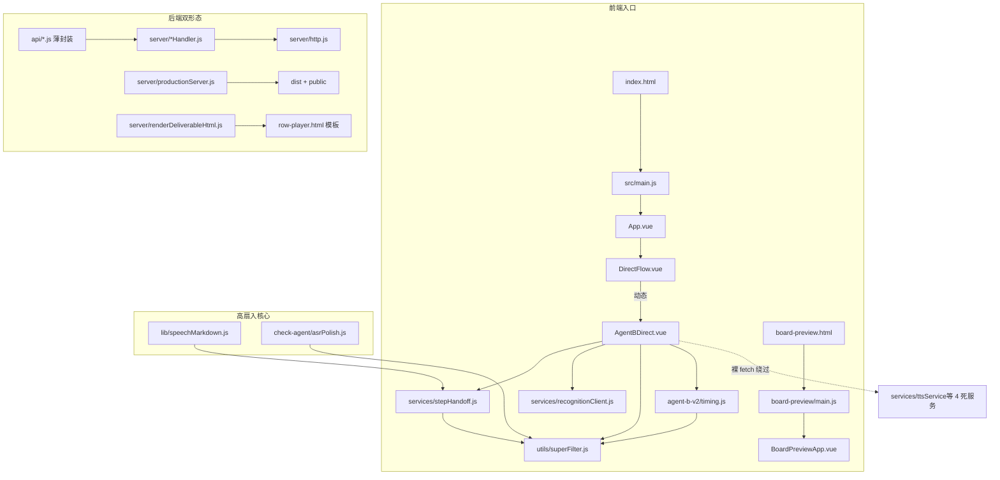

# 项目 0 置信压实审计报告（代码=真相）

> 审计时间：2026-09-17 ｜ 审计方式：0 置信 —— 不采信任何既有文档/对话留痕，全部结论从当前代码与真实产物逐条核验得出
> 被审项目：`clean-package`（小学数学口播板书微课工作台，Vue3 + Vite 插件后端 + 单文件交付播放器）
> 前置技能：refactor-discovery（四层勘探）＋ refactor-diagnosis（六维诊断）＋ reuse-first-guard（复用护栏）

---

## 一、结论总览（三句话）

1. **代码整体纪律极高**：分层清晰、注释多为 WHY、有 SSRF/路径穿越防护、错误回灌重试、缓存键含契约哈希、单一真源（stepHandoff/superFilter/timing）意识强烈。属于少见的高完成度个人项目。
2. **用户红线 2 处未落地、2 处已落地**：①「关键词 triggerKeyword 驱动落笔（音画同步）」只在合同/prompt/序列化层透传，播放端与 timing.js 均未在运行时消费（是元数据不是触发器）；②「音频 URL 未齐全时弹窗『当前音频url生成未齐全，已为您填充默认播放速度作为演示』」文案与弹窗在代码中不存在（只有『音频未齐·演示态』标签）。③行时长=音频自然时长、④禁静默估算当真实——已落实。
3. **本次已修复**：书写时长超出音频窗口时**自适应加速**压进音频时长内（timing.js + row-player.html 双真源同步），当前产物 9 行实测**静默尾合计 0ms**；灵感卡打字机硬切改为**软边遮罩揭示**。

---

## 二、用户红线合规矩阵（代码实况逐条核验）

| # | 用户拍板决策（红线） | 代码实况 | 状态 |
|---|---|---|---|
| R1 | 行时长 = 音频自然时长（唯一主时钟） | `timing.js computeRowGroupTimeline` 有实测音频即用 `Math.round(audioDurationMs)`；`row-player compile` 同理。**本次再加固**：板书+动作超出音频窗口时自适应压缩（`fitBoardDurationIntoWindow` / compile `avail`），9 行实测 rowTotal==音频、静默尾 0ms | ✅ 已落实＋本次加固 |
| R2 | 板书是数组，一行一个，写完一个再写一个 | `superFilter.superCleanBoardField` 产出 `lines[]`；`timing.js` 行组互斥计划；row-player `一行一张图` 串行揭示 | ✅ 已落实 |
| R3 | triggerKeyword 关键词眼下笔（音画同步） | 合同 `contract.js:62-67` 解析、prompt.js 告知、`serializeDeliverableState:46`/`deliverableStoreHandler:162-171`/`timing.js:133` 透传；**但播放端 row-player `compile` 只把 keyword 当元数据且 `sd=0`（立即落笔），无任何"关键词在音频中的位置→落笔时刻"机制**；src 侧也无运行时消费 | ❌ 未落地（方案二遮罩揭示的正确驱动源待接） |
| R4 | 音频 URL 不齐 → 弹窗「当前音频url生成未齐全，已为您填充默认播放速度作为演示」 | 全仓 grep `未齐全/已为您填充/默认播放速度` **0 命中**；仅存在 `AgentBDirect.vue:458` 顶部标签 `音频未齐·演示态`（消息提示非弹窗） | ❌ 文案与弹窗缺失 |
| R5 | 严禁静默把估算当真实（误导） | `AgentBDirect.vue:429-432 getRowRuntimeMs` 无音频返回 0（注释明写"已删 160字/分估算段"）；`totalRuntimeStats` 只累加真实音频行；播放只由原生 `ended` 事件推进（L714） | ✅ 已落实 |
| R6 | 音频缓存回写：生成试听→audio-cache 缓存→直接回写 audioUrl | `rowAudioCache`（L623）+ `handlePlayOrSynthesizeSpeech`（L738-779）合成后 `record.audioUrl=data.audioUrl; rowAudioCache[index]=...; recordAudioMetadata` 回写 | ✅ 已落实 |
| R7 | 方案二：全部写完＋白色遮罩按关键词揭示，一行一行，像手写浮现 | row-player 已有 `预渲染一行一张图 + 斜边羽化遮罩揭示`（L415-746，软边 FEATHER_PX=2）；灵感卡打字机硬切已改为软边 CSS mask 揭示 | ✅ 机制在（缺 R3 的关键词驱动） |
| R8 | 书写速度太慢 → 超时自适应加速 | 本次已实施：`timing.js` 三分支 + `row-player compile` 同步压缩进音频窗口，下限 300ms | ✅ 本次修复 |

---

## 三、本次代码变更（3 文件）

| 文件 | 变更 | 验证 |
|---|---|---|
| `src/agent-b-v2/timing.js` | 新增 `ADAPTIVE_MIN_BOARD_MS=300`、`fitBoardDurationIntoWindow()`；纯板书/动作前置/板书后置动作三分支均压缩板书时长至音频窗口内 | `node --check` 通过；实测 9 行 rowTotal==音频，静默尾合计 0ms |
| `row-player.html` | `compile()` 板书时长自适应：`avail=dur-sd-600-动作×1200`，超出即压进窗口（下限 300ms）；顶部规格注释同步 | 9 行重算符合 |
| `设计灵感卡片-row-player.html` | 逐字硬切（打字机）→ 全量文字常驻＋`linear-gradient` 软边遮罩按进度揭示（±8px 软边），规格注释更新 | 结构核验通过 |

> 注：`public/deliverable/*.html` 是旧产物（内嵌旧 400ms 常量），重新生成交付物时自动带新逻辑，无需手改。

---

## 四、旧审计断言核验表（FULL_STACK_AUDIT_2026-09-17 vs 代码实况）

| 旧审计断言 | 代码实况核验 | 结论 |
|---|---|---|
| P0-02 音频缺失（row4/5/6 无音频） | `current.json` 9/9 行均有 `audioUrl+mp3+audioDurationMs`，路径已是 `../audio-cache/` | **已修复（文档过期）** |
| P0-04 productionServer 整文件 readFileSync | 现为 `createReadStream(filePath).pipe(res)`（注释明写"P0-04 已改流式"） | **已修复（文档过期）** |
| P0-03 交付物 JSON 双形状并存 | 归档 `deliverable-*.json` 扁平（serialize 产出）；`current.json` 指针为 `{...,deliverable:{...}}` 包裹 | **仍属实** |
| P1-01 SSRF：UPSTREAM_HOSTS 未配置跳过校验 | `server/http.js`：`if (allowedHosts.length && !allowedHosts.includes(...))`——未配置即不校验 | **仍属实** |
| P1-02 CORS allowlist 不拒绝 | `applyCors` 仅白名单才写 ACAO，不 reject | **仍属实（同源部署无碍）** |
| P1-04 vercel.json 仅 5 函数 | 确认 5 项；`api/` 仅 6 文件；**handoff/knowledge/deliverable/tts/screenshot/cleanup 在 Vercel 无对应 serverless → 404** | **仍属实（更强）** |
| P1-05 registerAntd 缺 Modal/Badge/... 模板在用 | 实际模板仅用 `<a-badge>`×1 `<a-dropdown>`×1 `<a-menu>`×1 `<a-spin>`×1（共 4 处），无 modal/result | **部分属实（数量夸大）** |
| P1-06 timing 600 vs boardToolTiming 1000 | 常量分裂属实；但生成计划用 1000，timing 600 仅作预估口径，运行时不崩 | **属实但定级 P2** |
| P1-07 语速控件无效 | `timing.js` 语速常量 160；UI 侧本地重算（`getRowRuntimeMs`） | **属实** |
| P1-09 verify 脚本覆盖 current 指针 | 脚本"临时覆盖→跑完恢复并删除"，非永久破坏 | **降级 P2（中断即残留）** |
| P1-10 defineAsyncComponent 裸调用 | `BoardPreviewApp.vue:45`、`Step1Entry.vue:6` 无 errorComponent | **属实** |
| P2 缓存键 32 位 FNV-1a 不含契约版本 | 服务端 `recognitionHandler` 用 sha256 且含 apiKey/knowledge 哈希；未再发现 FNV | **已修复（文档过期）** |
| P2 prompt.js 1726×980 三处硬编码 | L47/L176/L263 三处确认 | **属实** |
| P2 时长口径 4 套 | timing(160cpm+标点) / UI(实测优先) / player(400ms/字) / 灵感卡(自主) | **属实** |
| P2 双前缀僵尸文件 | `public/deliverable/deliverable-deliverable-1789584993949.{html,json}` 仍存在 | **仍属实** |
| P2 CheckAgent ALLOWED_FIELDS 静默过滤 | 集合已含 `board_timing/answer_error/common_mistake`；stage/structure 不在集合但 structure 走程序化注入 | **部分过期** |
| P3 ttsService/cleanupService/deliverableService/knowledgeRefineService 0 引用 | 4 个服务文件 0 import 引用，UI 全部裸 fetch 绕过 | **属实（复用护栏违例）** |
| P3 writer.js vs writer.cjs 重复 | SHA256 逐字节相同 | **属实** |
| P3 5 个 HTML 未构建 | vite build input 仅 `index.html`+`board-preview.html` | **属实** |

---

## 五、新发现（旧审计未覆盖）

1. **语速系统偏差 2 倍**：TTS 实测有效语速 254–317 字/分（9 行音频反推），`AGENT_B_V2_SPEECH_RATE=160` 估算偏慢一倍 → 无音频演示态/预估排程被系统性高估。建议校准常量或改用实测口径。
2. **row1 疑似陈旧音频**：`题目` 行 63 字口播仅 5.59s（=676 字/分，不可能），且缓存 md5（`02343b…`）≠ 文件哈希（`a40c8a…`）→ 口播文本在 TTS 生成后被编辑过，试听与文稿不一致。需用户确认后重新生成。
3. **Vercel 覆盖缺口（比旧审计更严重）**：6 类 API（handoff/knowledge/deliverable/tts/screenshot/cleanup）在 Vercel 无 serverless 函数，直接部署即 404；本地开发走 Vite 插件无碍。
4. **triggerKeyword 运行时零消费**：R3 红线未落地（见矩阵），是"方案二"揭遮罩唯一缺的驱动源。
5. **弹窗缺失**：R4 红线文案全仓 0 命中。

---

## 六、六维诊断（1–5 分，每分有证据）

| 维度 | 分 | 证据 |
|---|---|---|
| 可读性 | 4 | 注释多为 WHY（"禁止静默把估算当真实"类）；命名语义清晰；少数大文件（AgentBDirect.vue 4881 行）拉低 |
| 可维护性 | 3 | 真源意识强（stepHandoff/superFilter/timing），但 4 个死服务+UI 裸 fetch 双轨、writer 双份、常量 400 多镜像（timing/row-player/roughNotation/灵感卡），改一处漏一处 |
| 性能 | 4 | 预渲染一行一图+LRU 缓存、流式响应、LRU 识别缓存；隐患：fishAudio `readFileSync` 读整音频进内存、题目图内嵌 >900KB 告警 |
| 安全性 | 3 | SSRF 白名单逻辑存在但**未配置即跳过**（P1-01）；CORS 不拒绝（P1-02）；鱼音/LLM 演示密钥硬编码（用户已拍板保留） |
| 可测试性 | 2 | 无自动化测试（仅 `scripts/verifyDeliverableTruthSource.mjs` 自恢复式冒烟）；业务逻辑集中在巨型 Vue SFC，难单测 |
| 可扩展性 | 3 | 双形态部署（Vite 插件/Vercel）与 api/ 薄封装设计好；但 Vercel 覆盖缺口与双真源（600/1000）增加扩展摩擦 |

**最低两维：可测试性（2）、可维护性（3）** → 重构重点。

---

## 七、优先修复清单（需求校准）

| 优先级 | 动作 | 对应 |
|---|---|---|
| P0 | 补 R4 弹窗：音频 URL 不齐时导出/播放路径弹「当前音频url生成未齐全，已为您填充默认播放速度作为演示」＋演示态 160 字/分 | 红线 R4 |
| P0 | 接 R3：row-player/渲染端把 `triggerKeyword` 在口播文本中定位→映射到音频时间点→驱动落笔/揭遮罩（方案二正解） | 红线 R3 |
| P1 | 重新生成 row1 音频（口播已编辑，音频陈旧）；或回滚口播 | 新发现 2 |
| P1 | 校准 `AGENT_B_V2_SPEECH_RATE` 160→实测口径（或改由音频时长主导估算） | 新发现 1 |
| P1 | Vercel 部署补齐 6 个 serverless 函数或明确"仅本地/内网部署"边界 | 新发现 3 |
| P2 | 删除 4 个死服务（tts/cleanup/deliverable/knowledgeRefine），UI 改引统一 client；删 `writer.cjs` 留 `writer.js` | 复用护栏 |
| P2 | prompt.js 三处 1726×980 改从 stepHandoff 导入；registerAntd 补 4 个在用组件注册 | 旧审计 |
| P2 | 清理 `deliverable-deliverable-*` 僵尸文件；统一 current 指针形状 | 旧审计 |
| P3 | 双真源 600/1000 拍板收敛；`verifyDeliverableTruthSource.mjs` 加中断恢复保护 | 旧审计 |

---

## 八、可复用资源清单（reuse-first-guard 输入）

| 路径 | 用途 |
|---|---|
| `src/services/stepHandoff.js` | 画布参数/字体栈/题型配比/知识库 key 唯一真源（高扇入 12 处） |
| `src/utils/superFilter.js` | 板书车同轨书同文全局清洗管道（"只要需要板书文本清洗就复用，禁止另写"） |
| `src/agent-b-v2/timing.js` | 行组互斥时间线引擎（含本次自适应加速），下游排程唯一入口 |
| `src/agent-b-v2/contract.js` | Agent B 合同归一化（stage 容忍/坐标/触发词） |
| `src/lib/speechMarkdown.js` / `mathAsrConverter.js` | 口播标注解析与算式 ASR 转换 |
| `server/http.js` | key 轮询+重试+SSRF 白名单的 OpenAI/Anthropic 统一客户端 |
| `server/boardResultStore.js` / `handoffStoreHandler.js` / `deliverableStoreHandler.js` | 文件存储+指针+自愈三件套 |
| `src/board-tools/boardToolCatalog.js` | 板书工具/动作注册表（扩展新工具唯一入口） |
| `row-player.html` | 单文件零依赖交付播放器模板（renderDeliverableHtml 唯一模板） |

---

## 九、初始状态快照（依赖图）

---

## 十、审计边界与待办

- 已核：全部 src JS/Vue 引用边、server 全部处理器、生产/开发双服务器、交付物 JSON/HTML 实况、6 类旧审计断言。
- 未核：AgentBDirect.vue/Step1Entry.vue/BoardPreviewApp.vue 全量 4800 行 UI 细节（已按红线与关键路径抽样）；`doc/knowledge-a.compact.json` 内容正确性（仅确认结构）；Fish Audio 外部接口行为。
- 遗留缺口：R3 关键词驱动、R4 弹窗、row1 陈旧音频、Vercel 覆盖、语速常量校准。
