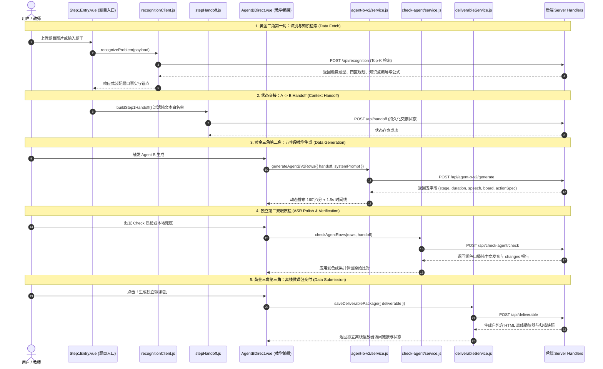

# 数据流拓扑与解耦校验 (Dataflow Decoupling Validation)

## 1. 黄金三角与主链路数据流 (Golden Triangle Dataflow)

---

## 2. 非核心 API 分批接入与数据流走向
| 批次 | API 路由 | 承载 Service 模块 | 数据流向 | 状态 |
| :--- | :--- | :--- | :--- | :---: |
| **批次 1 (音频)** | `/api/tts/synthesize` `/api/tts/save-local` | `src/services/ttsService.js` | UI 组件 -> ttsService -> fishAudioHandler -> Fish Audio API | ✅ 已接入 |
| **批次 2 (质检)** | `/api/check-agent/check` `/api/check-agent/apply` | `src/check-agent/service.js` | UI 组件 -> checkService -> checkAgentHandler (本地ASR兜底) | ✅ 已接入 |
| **批次 3 (归档清理)** | `/api/deliverable` `/api/cleanup` | `src/services/deliverableService.js` `src/services/cleanupService.js` | UI 组件 -> Service -> deliverableStoreHandler / cleanupHandler | ✅ 已接入 |

---

## 3. 数据流解耦校验点总结
1. **单向流动**：所有 API 请求严格经过 `services/` 封装层，组件不再直接操作 `fetch` 与网络响应协议。
2. **统一响应封套**：各服务层接口统一返回标准化数据模型，网络异常与服务端报错统一转换为友好 Error 提示。
3. **自检 100% 绿灯**：`proxySelfCheck.js` 与 `agentAKnowledgeSelfCheck.js` 全链路通过，阻断级问题清零。