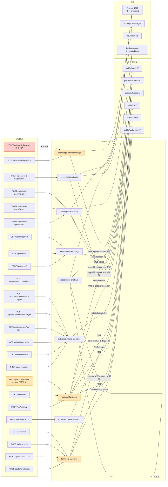

# 02 · 业务逻辑流映射图（Mermaid）

> 阶段一·深度扫描产出 ｜ 生成时间：2026-09-17
> 范围：前端 + 后端 + 持久化 + 上游 LLM 完整链路
> 包含 4 张图：① 系统全景图 ② 主链路时序图 ③ API 数据流图 ④ 持久化目录关系图

---

## 图 1 · 系统全景架构图

```mermaid
flowchart TB
    subgraph Browser["🌐 浏览器（Vue3 SPA）"]
        App["App.vue<br/>壳"]
        DF["DirectFlow.vue<br/>Step1↔B 切页器"]
        Step1["Step1Entry.vue<br/>1523行 · 贴题/识别/截图/handoff"]
        AgentB["AgentBDirect.vue<br/>5330行 · 五字段工作台"]
        BCA["BoardContentLayer.vue<br/>1015行 · L2 内容层"]
        RBP["RealBoardPreview.vue<br/>299行 · L1-L4 叠层"]
        BPA["BoardPreviewApp.vue<br/>1961行 · 全屏预览"]
        VT["VisualTimeline.vue"]
        PLM["ProcessLoadingModal.vue"]
        GPL["GlobalPulseLoading.vue"]
        
        subgraph Services["服务层"]
            SH["stepHandoff.js ⭐<br/>画布参数唯一真源"]
            RC["recognitionClient.js"]
            AAK["agentAKnowledge.js<br/>本地 n-gram"]
            GL["globalLoading.js"]
        end
        
        subgraph BoardTools["板书工具"]
            BTC["boardToolCatalog.js"]
            HAS["handActionScheduler.js<br/>单手互斥队列"]
            RDT["roughDrawingTool.js<br/>line/arrow"]
            RNT["roughNotationTool.js<br/>7种标记"]
            DIT["drawIntentTool.js ⚠️<br/>prompt.js 禁止"]
            TTR["textTargetRegistry.js"]
        end
        
        subgraph CheckAgent["Check Agent C"]
            CAC["contract.js"]
            CAS["service.js"]
            CAP["prompt.js"]
            ASR["asrPolish.js<br/>本地 ASR 兜底"]
        end
        
        subgraph Lib["lib 配置/工具"]
            UAC["userApiConfig.js<br/>Agent A"]
            ABAC["agentBApiConfig.js<br/>Agent B"]
            CAAC["checkAgentApiConfig.js<br/>Agent C"]
            MAC["mathAsrConverter.js"]
            SMD["speechMarkdown.js<br/>三种 MD 导出"]
            DS["dualStore.js ⚠️<br/>死代码"]
            SIDB["simpleIndexedDb.js ⚠️<br/>死代码"]
            CDL["cdnLoader.js ⚠️<br/>死代码"]
        end
        
        subgraph Utils["utils"]
            CC["canvasCoords.js"]
            BL["boardLayout.js<br/>layoutBoardRows"]
            MT["mathText.js<br/>KaTeX"]
        end
        
        subgraph Timing["时序"]
            TIM["timing.js<br/>1D 单手时间线"]
        end
        
        subgraph Skills["Skill 模块化"]
            SKI["skills/index.js"]
            SKDF["default-fallback/"]
            SKLE["liyongle-elementary/<br/>7段拼接"]
        end
    end
    
    subgraph ViteDev["⚡ Vite Dev Server (port 3001/3200/5199)"]
        Health["/api/health<br/>健康检查 ✅"]
        Mock["/api/mock/problem<br/>Mock 数据 ⚠️ prod 仍生效"]
        
        subgraph Handlers["server/ Node Handlers"]
            RH["recognitionHandler.js<br/>Agent A 识别 + 24h 缓存"]
            ABH["agentBV2Handler.js<br/>B 生成 + 软降级"]
            CAH["checkAgentHandler.js<br/>三重降级 ASR"]
            HSH["handoffStoreHandler.js<br/>public/handoff/"]
            DSH["deliverableStoreHandler.js<br/>public/deliverable/<br/>⚠️ 目录穿越"]
            SSH["screenshotStoreHandler.js<br/>public/pic/"]
            KRH["knowledgeRefineHandler.js<br/>⚠️ /revert 不可达"]
            FAH["fishAudioHandler.js<br/>TTS<br/>⚠️ 双Key硬编码"]
            CLH["cleanupHandler.js<br/>⚠️ 误删 .original.json"]
            PS["productionServer.js<br/>bun run start"]
            HTTP["http.js<br/>CORS+UPSTREAM"]
        end
    end
    
    subgraph Vercel["▲ Vercel Functions (api/)"]
        V1["agent-b-v2/generate.js"]
        V2["check-agent/{check,apply,revert}.js"]
        V3["recognition/problem.js"]
        V4["cleanup.js"]
        VMiss["❌ 缺 16 个端点<br/>handoff/deliverable/screenshot/<br/>tts/knowledge/health/mock"]
    end
    
    subgraph Persist["💾 持久化（public/）"]
        HDir["handoff/<br/>handoff-*.json + .original.json + current.json"]
        DDir["deliverable/<br/>deliverable-*.json/.html + current.*<br/>⚠️ handdraw-player.html 缺失"]
        BRDir["board-result/<br/>board-result-*.json + .original.json"]
        ADir["audio/<br/>audio-*-stepN.mp3"]
        ACDir["audio-cache/<br/>md5.mp3"]
        PDir["pic/<br/>shot-*.jpg + ⚠️ audio-*.mp3 副本"]
    end
    
    subgraph Upstream["☁️ 上游 LLM/TTS"]
        OpenAI["OpenAI 兼容<br/>endpoint 用户配置"]
        Anthropic["Anthropic Messages<br/>apiType=anthropic-messages"]
        FishAudio["Fish Audio<br/>api.fish.audio/v1/tts"]
        Knowledge["doc/knowledge-a.compact.json<br/>247 条知识点"]
    end
    
    App --> DF
    DF -->|emit enter-board-draft| Step1
    DF -->|GET /api/handoff| AgentB
    Step1 -->|emit| AgentB
    Step1 --> SH
    Step1 --> RC
    Step1 --> AAK
    Step1 --> BL
    Step1 --> RBP
    Step1 --> BCA
    AgentB --> ABH
    AgentB --> CAH
    AgentB --> FAH
    AgentB --> DSH
    AgentB --> KRH
    AgentB --> CLH
    AgentB --> TIM
    AgentB --> SMD
    AgentB --> Skills
    AgentB --> RBP
    RBP --> BTC
    BTC --> HAS
    BTC --> RDT
    BTC --> RNT
    BTC --> DIT
    BTC --> TTR
    
    RC -->|POST /api/recognition/problem| RH
    ABH -->|POST /api/agent-b-v2/generate| OpenAI
    ABH -->|POST| Anthropic
    CAH -->|POST /api/check-agent/check| OpenAI
    RH -->|POST| OpenAI
    KRH -->|POST /api/knowledge/refine| OpenAI
    FAH -->|POST| FishAudio
    RH --> Knowledge
    CAH --> Knowledge
    
    RH --> HDir
    ABH --> BRDir
    CAH --> BRDir
    DSH --> DDir
    SSH --> PDir
    FAH --> ACDir
    FAH --> ADir
    FAH --> PDir
    KRH --> HDir
    CLH -->|清理| ADir
    CLH -->|清理| ACDir
    CLH -->|清理 ⚠️ 误删| PDir
    CLH -->|清理 ⚠️ 误删| BRDir
    CLH -->|清理 ⚠️ 误删| DDir
    
    V1 --> ABH
    V2 --> CAH
    V3 --> RH
    V4 --> CLH
    
    style AgentB fill:#ffcccc,stroke:#cc0000
    style Step1 fill:#ffcccc,stroke:#cc0000
    style BPA fill:#ffcccc,stroke:#cc0000
    style BCA fill:#ffcccc,stroke:#cc0000
    style DSH fill:#ffe4b5,stroke:#cc8800
    style KRH fill:#ffe4b5,stroke:#cc8800
    style FAH fill:#ffe4b5,stroke:#cc8800
    style CLH fill:#ffe4b5,stroke:#cc8800
    style DIT fill:#ffe4b5,stroke:#cc8800
    style DS fill:#f0f0f0,stroke:#999999
    style SIDB fill:#f0f0f0,stroke:#999999
    style CDL fill:#f0f0f0,stroke:#999999
    style VMiss fill:#ffcccc,stroke:#cc0000
    style SH fill:#ccffcc,stroke:#009900
    style Knowledge fill:#ccffcc,stroke:#009900
```



---

## 图 2 · 主链路时序图（贴题 → 生成 → 导出 → 播放）

```mermaid
sequenceDiagram
    autonumber
    actor User as 👤 用户
    participant FE as 前端 Vue3
    participant Vite as Vite Dev Middleware
    participant H as server Handlers
    participant LLM as 上游 LLM
    participant FS as public/ 持久化
    
    Note over User,FS: 阶段 A · 贴题识别
    User->>FE: 上传图片/输入题文
    FE->>Vite: POST /api/recognition/problem<br/>{imageDataUrl/apiKey/endpoint/model}
    Vite->>H: recognitionHandler.js
    H->>H: 内存缓存命中？(24h/100条)
    alt 缓存命中
        H-->>FE: 200 {ok, result, cached:true}
    else 缓存未命中
        H->>H: selectAgentAKnowledge Top-K
        H->>LLM: requestChatCompletion (60s)
        LLM-->>H: {result, knowledgeAnalysis}
        H->>H: hydrateAgentAKnowledge 回填
        H->>H: writeCache
        H-->>FE: 200 {ok, result, cached:false, knowledgeRetrieval}
    end
    
    Note over User,FS: 阶段 B · 四区规划 + 截图 + handoff
    User->>FE: 点击「规划四标签+网格」
    FE->>FE: planLabelsFromTopic (boardLayout.js)
    FE->>FE: 自动截图 snapdom.toCanvas
    FE->>Vite: POST /api/screenshot<br/>{imageBase64}
    Vite->>H: screenshotStoreHandler
    H->>FS: 写 public/pic/shot-*.jpg
    H-->>FE: 200 {urlPath}
    User->>FE: 点击「确定进入生成表」
    FE->>FE: buildStep1Handoff (stepHandoff.js)
    FE->>Vite: POST /api/handoff<br/>{handoff}
    Vite->>H: handoffStoreHandler
    H->>FS: 写 public/handoff/handoff-*.json<br/>+ current.json
    H-->>FE: 200 {projectCode, filename}
    FE->>FE: emit enter-board-draft → 切到 AgentB 页
    
    Note over User,FS: 阶段 C · Agent B 生成五字段
    User->>FE: 点击「生成」按钮
    FE->>FE: bCacheGet (localStorage 24h)
    alt 缓存命中
        FE-->>FE: 复用旧 rows
    else 缓存未命中
        FE->>Vite: POST /api/agent-b-v2/generate<br/>{handoff, systemPrompt, skillId, canvasParams, temperature}
        Vite->>H: agentBV2Handler.js
        H->>H: normalizeAgentBPromptHandoff 白名单过滤
        H->>LLM: requestChatCompletion (300s OpenAI / 90s Anthropic)
        LLM-->>H: JSON {rows:[...]}
        H->>H: parseAgentBV2Response (contract.js)
        alt 解析成功
            H->>H: validateAgentBV2Rows
            H->>H: normalizeBoard 剥离 startCoord
        else 解析失败
            H->>H: tryExtractFallbackRows 软降级 ⚠️ KNOWN_ISSUES P0-2
        end
        H->>FS: 写 public/board-result/board-result-*.json + current.json
        H-->>FE: 200 {ok, rows, projectCode, filename, usage}
        FE->>FE: applyAgentBV2Timeline (timing.js)
        FE->>FE: bCacheSet
    end
    
    Note over User,FS: 阶段 D · 单行 TTS 合成
    User->>FE: 点击某行 🔊 喇叭
    FE->>Vite: POST /api/tts/synthesize<br/>{text, referenceId}
    Vite->>H: fishAudioHandler
    H->>H: md5 缓存命中？(audio-cache)
    alt 缓存未命中
        H->>LLM: POST api.fish.audio/v1/tts<br/>(多 Key 轮询)
        LLM-->>H: audio buffer
        H->>FS: 写 public/audio-cache/md5.mp3
    end
    H-->>FE: 200 {audioUrl, cached}
    FE->>FE: readAudioDuration (loadedmetadata)
    FE->>FE: 重算时间线 applyAgentBV2Timeline
    
    Note over User,FS: 阶段 E · TTS 保存本地
    User->>FE: 点击「保存本地」
    FE->>Vite: POST /api/tts/save-local
    Vite->>H: fishAudioHandler.saveSpeechLocally
    H->>FS: 写 public/audio/audio-*-stepN.mp3<br/>+ ⚠️ public/pic/audio-*-stepN.mp3 副本
    H-->>FE: 200 {audioUrl, companionPicUrl}
    
    Note over User,FS: 阶段 F · Check Agent C 润色
    User->>FE: 点击「Check Agent」
    FE->>Vite: POST /api/check-agent/check<br/>{currentRows, apiKey, endpoint, model, mode?}
    Vite->>H: checkAgentHandler.js
    alt mode=asr_fast 或 缺 credentials
        H->>H: polishRowsASR 本地降级
    else 远程调用
        H->>H: readCurrentResult 取 handoff
        H->>LLM: requestChatCompletion (25s 超时)
        alt 远程成功
            H->>H: polishRowsASR 二次保障
        else 远程失败/超时/解析失败
            H->>H: polishRowsASR 兜底
        end
    end
    H-->>FE: 200 {ok, rows, changes, checkStatus, note}
    User->>FE: 点击「应用」
    FE->>Vite: POST /api/check-agent/apply<br/>{rows}
    Vite->>H: checkAgentHandler.handleCheckApplyRequest
    H->>FS: 写 board-result-*.original.json 备份<br/>+ 覆写当前 board-result
    H-->>FE: 200 {ok, filename, rows}
    
    Note over User,FS: 阶段 G · 知识点修缮
    User->>FE: 点击「优化确认」
    FE->>Vite: POST /api/knowledge/refine
    Vite->>H: knowledgeRefineHandler
    H->>FS: 写 handoff-*.original.json 备份
    H->>LLM: requestChatCompletion (60s)
    LLM-->>H: 修缮 JSON
    H->>H: 字段级 merge (5 字段)
    H->>FS: 覆写当前 handoff
    H-->>FE: 200 {ok, handoff}
    Note over H,FS: ⚠️ /api/knowledge/revert 分支不可达<br/>(L3-1 BUG，备份永远读不回)
    
    Note over User,FS: 阶段 H · 导出 + 生成交付物
    User->>FE: 点击「导出口播稿 MD」/「要素表」/「分镜表」
    FE->>FE: speechMarkdown.js 生成 MD → 下载
    User->>FE: 点击「生成 HTML 产物」
    FE->>Vite: POST /api/deliverable<br/>{deliverable}
    Vite->>H: deliverableStoreHandler
    H->>H: layoutBoardRows 注入 startCoord
    H->>H: computeRowGroupTimeline 注入 estimatedDurationMs
    H->>H: renderDeliverableHtml ⚠️ 模板缺失必走降级
    H->>FS: 写 deliverable-*.json/.html + current.*
    H-->>FE: 200 {url}
    User->>FE: 点击「打开 HTML 产物」
    FE->>FE: window.open('/deliverable/handdraw-player.html')<br/>⚠️ 404 (L3-2 BUG)
    
    Note over User,FS: 阶段 I · 清理临时文件
    User->>FE: 点击「清理」
    FE->>Vite: POST /api/cleanup
    Vite->>H: cleanupHandler
    H->>FS: 删 5 目录非保留集<br/>⚠️ 误删 *.original.json (L3-6 BUG)
    H-->>FE: 200 {ok, count, bytes, files[]}
```



---

## 图 3 · API 数据流图（端点 → handler → 上游 → 落盘）



---

## 图 4 · 持久化目录关系图

```mermaid
flowchart TB
    subgraph PublicDir["public/"]
        HDir["📁 handoff/<br/>Step1 交接文件"]
        BRDir["📁 board-result/<br/>B 生成结果"]
        DDir["📁 deliverable/<br/>最终交付物"]
        PicDir["📁 pic/<br/>截图 + ⚠️ 音频副本"]
        AudDir["📁 audio/<br/>TTS 时序归档"]
        AudCDir["📁 audio-cache/<br/>TTS 去重缓存"]
    end
    
    subgraph FileTypes["文件类型"]
        H1["handoff-YYYYMMDD-HHMMSS-SSS.json"]
        H2["handoff-*.original.json<br/>知识点修缮备份"]
        H3["current.json<br/>{projectCode, filename, createdAt}"]
        
        B1["board-result-YYYYMMDD-HHMMSS-SSS.json"]
        B2["board-result-*.original.json<br/>Check 备份"]
        B3["current.json"]
        
        D1["deliverable-{code}.json"]
        D2["deliverable-{code}.html"]
        D3["current.json + current.html<br/>⚠️ current.html 是降级重定向"]
        D4["deliverable.schema.json"]
        D5["DELIVERABLE_API_SPEC.md<br/>重复 doc/ 副本"]
        D6["❌ handdraw-player.html<br/>不存在"]
        
        P1["shot-YYYYMMDD-HHMMSS-SSS.jpg<br/>截图"]
        P2["⚠️ audio-YYYYMMDD-HHMMSS-SSS-stepN.mp3<br/>TTS 副本（content-type 错配）"]
        
        A1["audio-YYYYMMDD-HHMMSS-SSS-stepN.mp3"]
        
        AC1["md5(text::refId::model).mp3<br/>去重缓存"]
    end
    
    HDir --> H1
    HDir --> H2
    HDir --> H3
    BRDir --> B1
    BRDir --> B2
    BRDir --> B3
    DDir --> D1
    DDir --> D2
    DDir --> D3
    DDir --> D4
    DDir --> D5
    DDir -.->|❌ 缺失| D6
    PicDir --> P1
    PicDir --> P2
    AudDir --> A1
    AudCDir --> AC1
    
    subgraph Writers["写入方"]
        W1["handoffStoreHandler"]
        W2["boardResultStore"]
        W3["deliverableStoreHandler"]
        W4["screenshotStoreHandler"]
        W5["fishAudioHandler.synthesize"]
        W6["fishAudioHandler.save-local"]
        W7["knowledgeRefineHandler"]
        W8["checkAgentHandler.apply"]
    end
    
    subgraph Readers["读取方"]
        R1["handoffStoreHandler.readCurrent"]
        R2["boardResultStore.readCurrent"]
        R3["deliverableStoreHandler.read"]
        R4["AgentBDirect.vue<br/>window.open"]
        R5["AgentBDirect.vue<br/>audio element"]
        R6["AgentBDirect.vue<br/>GET /api/handoff"]
    end
    
    W1 -->|POST /api/handoff| HDir
    W7 -->|POST /api/knowledge/refine<br/>写 .original.json + 覆写| HDir
    W8 -->|POST /api/check-agent/apply<br/>写 .original.json + 覆写| BRDir
    
    R6 -->|GET /api/handoff| HDir
    R1 --> HDir
    R2 --> BRDir
    R3 --> DDir
    R4 -.->|❌ 404| D6
    R5 --> AudDir
    
    subgraph Cleanup["cleanupHandler 规则"]
        C1["audio-cache/ → 全删"]
        C2["audio/ → 全删"]
        C3["pic/ → 全删<br/>⚠️ 含 audio-*.mp3 副本"]
        C4["board-result/ → 保留 current.json + 保留集<br/>⚠️ 不保留 .original.json"]
        C5["deliverable/ → 保留 current.* + 保留集<br/>⚠️ 不保留 .original.json"]
        C6["❌ handoff/ 不清理 → 无限增长"]
    end
    
    Cleanup -.->|误删 ⚠️| B2
    Cleanup -.->|误删 ⚠️| H2
    
    style D6 fill:#ffcccc,stroke:#cc0000
    style P2 fill:#ffe4b5,stroke:#cc8800
    style D3 fill:#ffe4b5,stroke:#cc8800
    style C4 fill:#ffe4b5,stroke:#cc8800
    style C5 fill:#ffe4b5,stroke:#cc8800
    style C6 fill:#ffe4b5,stroke:#cc8800
```



---

## 业务流映射图说明

### 主链路（唯一入口）
```
src/main.js → src/App.vue → src/agent-b-v2/DirectFlow.vue
  → src/components/Step1Entry.vue (贴题识别)
  → POST /api/handoff → server/handoffStoreHandler.js
  → emit enter-board-draft → DirectFlow 切到 AgentB 页
  → src/agent-b-v2/AgentBDirect.vue (五字段工作台)
  → src/agent-b-v2/service.js (POST /api/agent-b-v2/generate)
  → server/agentBV2Handler.js → 上游 LLM
  → src/agent-b-v2/contract.js parseAgentBV2Response
  → src/agent-b-v2/timing.js applyAgentBV2Timeline
  → src/components/RealBoardPreview.vue (L1-L4 叠层渲染)
  → src/board-tools/boardToolCatalog.js (L3 动作执行)
  → src/agent-b-v2/AgentBDirect.vue (导出 MD / 生成 deliverable)
  → server/deliverableStoreHandler.js → public/deliverable/
```

### 回退链
```
AgentBDirect.vue emits 'back-to-step1'
  → DirectFlow.backToStep1()
  → Step1Entry.vue
```

### Check Agent 链（可选，不阻断）
```
AgentBDirect.vue 点击「Check Agent」
  → src/check-agent/service.js (POST /api/check-agent/check)
  → server/checkAgentHandler.js → 上游 LLM (25s) + 本地 ASR 兜底
  → src/check-agent/contract.js parseCheckAgentResponse
  → POST /api/check-agent/apply → server/checkAgentHandler 写 .original.json + 覆写
```

### TTS 链
```
AgentBDirect.vue 点击单行 🔊
  → POST /api/tts/synthesize → server/fishAudioHandler
  → 上游 fish.audio → 写 public/audio-cache/md5.mp3
  → 前端 readAudioDuration → 重算时间线
点击「保存本地」
  → POST /api/tts/save-local → 写 public/audio/audio-*-stepN.mp3 + ⚠️ pic 副本
```

### 关键发现
1. **业务流核心：Step1Entry → AgentBDirect → deliverable**，所有环节均接通，未发现整链断裂。
2. **3 处业务断点**：① handdraw-player.html 缺失（打开产物 404）；② /api/knowledge/revert 不可达（revert 功能完全失效）；③ pic 目录 content-type 错配（音频副本无法播放）。
3. **3 处长期静默失效**：① drawIntentTool 注册但 prompt.js 禁止（永不触发）；② cdnLoader/dualStore/simpleIndexedDb 三处死代码；③ boardTypography.css 字体族无消费者。
4. **2 处一致性双轨**：① UI canvasParams ref 与 handoff canvasParams 并存（用户改 UI 不生效）；② question/topic 命名双轨（数据层 question / UI 层 topic）。

---

> 业务流映射图阶段一产出完毕。下一份《性能评估表》将基于此图量化各环节健康度。
