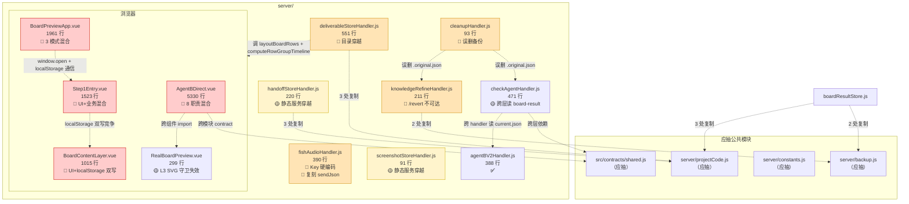
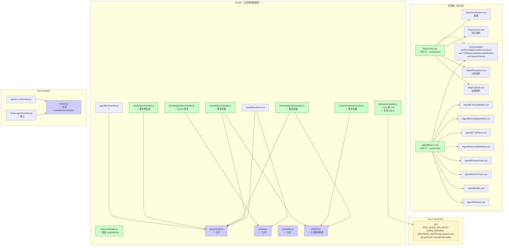
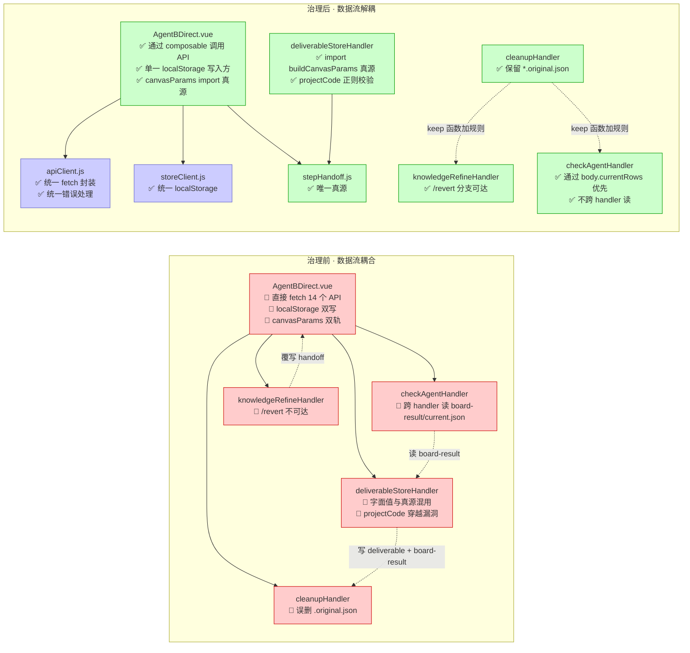

# 06 · 治理记录与解耦边界图

> 阶段二·遗留识别与分级治理产出 ｜ 生成时间：2026-09-17
> 包含：① 六步心法治理示例（3 个典型）② 解耦边界 Mermaid 图 ③ 治理后预期架构

---

## 一、六步心法治理示例（3 个典型）

### 示例 1 · L3-S01 Fish Audio 双 Key 硬编码（安全 P0）

#### 步骤 1 · 插旗标记
```javascript
// fishAudioHandler.js:12-15
// @legacy L3-S01 · 安全 P0 · 待移到 .env
const DEFAULT_API_KEYS = [
  'sk-fish-5-R0Y_BCg8RXVY_iaokb0BAWLY1jc9p90F9zaox9FWk',
  'sk-fish-MYToCn_B0xhQT-9H4tV_YXR9aTwWg_-CjHWkXli4iec'
]
```

#### 步骤 2 · 最小单元划分
- 受影响文件：`fishAudioHandler.js` + `.env.example` + `.env`（本机）
- 不影响：其他 handler、前端、Vercel Functions
- 范围：仅删除硬编码 + 改读 `process.env.FISH_AUDIO_API_KEYS`

#### 步骤 3 · 逐模块提取
**fishAudioHandler.js 改动**：
```javascript
// Before
const DEFAULT_API_KEYS = ['sk-fish-...', 'sk-fish-...']
// After
const DEFAULT_API_KEYS = (process.env.FISH_AUDIO_API_KEYS || '')
  .split(',')
  .map(s => s.trim())
  .filter(Boolean)
```

**.env.example 改动**：
```bash
# 已有：FISH_AUDIO_API_KEY=
# 已有：FISH_AUDIO_API_KEYS=
# 已有：CORS_ORIGINS=
# 已有：UPSTREAM_HOSTS=
# 不需新增字段，已存在
```

**本机 .env 改动**（不进 git）：
```bash
# 加入：
FISH_AUDIO_API_KEYS=sk-fish-5-R0Y_BCg8RXVY_iaokb0BAWLY1jc9p90F9zaox9FWk,sk-fish-MYToCn_B0xhQT-9H4tV_YXR9aTwWg_-CjHWkXli4iec
```

#### 步骤 4 · 改一测一
1. 改完后跑 `node -e "import('./server/fishAudioHandler.js').then(() => console.log('ok'))"`
2. 启动 vite dev：`npm run dev`（应在端口 3001）
3. 手测 `GET /api/tts/info`：应返回 `keyCount: 2` 且 `keys: ['sk-fish-5-R0Y_...', 'sk-fish-MYToCn_...']`（mask 后）
4. 手测 `POST /api/tts/synthesize`：应能合成音频
5. 删除 .env 中的 Key 后重启，应返回 `keyCount: 0` 且 synthesize 报错

#### 步骤 5 · 风险可控
- 不影响主链路（A/B/Check Agent 不调用 Fish Audio）
- 仅 TTS 功能受影响
- 若失败可立即回滚（git revert）

#### 步骤 6 · 留痕归档
- ENGINEERING_LOG.md 追加：
  ```markdown
  ## 2026-09-17 · L3-S01 Fish Audio Key 移到 .env
  
  ### 背景
  `fishAudioHandler.js:12-15` 硬编码 2 个 Fish Audio Key，会随 git push 泄露。
  
  ### 思路
  Key 是用户预设的演示账号（用户明示保留），但不应在源码中明文。
  
  ### 执行步骤
  1. 删除 DEFAULT_API_KEYS 数组
  2. 改读 process.env.FISH_AUDIO_API_KEYS（逗号分隔）
  3. .env.example 字段已存在，无需新增
  4. 本机 .env 加入两个 Key
  
  ### 代码变更
  - `server/fishAudioHandler.js:12-15` 改为 env 读取
  - `.env` 加入 FISH_AUDIO_API_KEYS（不进 git）
  
  ### 验证结果
  - node import 链通过
  - vite dev 3001 启动成功
  - GET /api/tts/info 返回 keyCount=2
  - POST /api/tts/synthesize 合成成功
  
  ### 接力棒
  - 用户预设账号已保留（明示要求）
  - Vercel 部署时需在 Vercel Env 配置 FISH_AUDIO_API_KEYS
  ```
- DECISIONS.md 追加决策记录
- 本表 `L3-S01` 状态改 `✅ 已治理`

---

### 示例 2 · L3-B01 knowledge/revert 分支不可达（业务 P0）

#### 步骤 1 · 插旗标记
```javascript
// knowledgeRefineHandler.js:88
// @legacy L3-B01 · 业务 P0 · /revert 分支不可达
if (path === '/api/knowledge/revert') {
```

#### 步骤 2 · 最小单元划分
- 受影响文件：`knowledgeRefineHandler.js` 单文件
- 不影响：其他 handler、前端、Vercel Functions
- 范围：仅修正 path 判断字符串

#### 步骤 3 · 逐模块提取
**knowledgeRefineHandler.js 改动**：
```javascript
// Before
if (path === '/api/knowledge/revert') {
  // ...revert 逻辑
}
// After
if (path === '/revert') {
  // ...revert 逻辑
}
```

原因：vite middleware `vite.config.js` 中：
```javascript
knowledgeRefinePlugin()  // 内部 server.middlewares.use('/api/knowledge', handler)
```
进入 handler 时 `req.url` 已经被剥离前缀 `/api/knowledge`，所以 `path` 只可能是 `/refine` 或 `/revert`，永远不会是 `/api/knowledge/revert`。

productionServer.js:69-71 也用 `withUrl(req, suffix)` 改写。

#### 步骤 4 · 改一测一
1. 改完后跑 `npm run check:proxy`
2. 启动 vite dev 3001
3. 先调 `POST /api/knowledge/refine` 写入 `.original.json` 备份
4. 再调 `POST /api/knowledge/revert`：应返回 `{ok, filename, handoff, reverted:true}`
5. 验证 handoff 文件已恢复为 original 内容

#### 步骤 5 · 风险可控
- 不影响主链路
- 仅影响「还原」功能（之前完全失效）
- 若失败可立即回滚

#### 步骤 6 · 留痕归档
- 同示例 1 格式追加 ENGINEERING_LOG.md
- 关键验证截图：revert 后 handoff 文件 diff

---

### 示例 3 · L2-F01 AgentBDirect.vue 拆分（维护 L3-M01）

#### 步骤 1 · 插旗标记
```vue
<!-- AgentBDirect.vue -->
<!-- @legacy L2-F01 / L3-M01 · 5330 行超限 · 待拆分 -->
<script setup>
```

#### 步骤 2 · 最小单元划分（按职责拆 8 个子组件 + 5 个 composables）

**子组件**：
1. `<AgentBToolbar>` — 顶部工具栏（API 配置 / Skill 选择 / 生成按钮）
2. `<AgentBTable>` — 五字段表格（rows 渲染 + 拖拽排序）
3. `<AgentBActionPanel>` — Check Agent 操作面板
4. `<AgentBExportPanel>` — 导出 MD / 生成 deliverable
5. `<AgentBDeliverableModal>` — 交付物弹窗
6. `<AgentBTTSPlayer>` — TTS 单行播放器
7. `<AgentBKnowledgeRefine>` — 知识点修缮弹窗
8. `<AgentBCleanupModal>` — 清理弹窗

**Composables**：
1. `useRowsState.js` — rows reactive 状态 + 拖拽 + 增删改
2. `useBGeneration.js` — generateRows + 缓存 + Check Agent
3. `useTTSPlayer.js` — TTS 合成 + 音频时长回填
4. `useDeliverableExport.js` — 导出 MD + 生成 deliverable
5. `useCanvasParams.js` — canvasParams 状态 + 真源同步

#### 步骤 3 · 逐模块提取（非破坏性）

**Phase 1**（不动 AgentBDirect.vue 逻辑，先抽 composables）：
- 把 reactive 状态、computed、watch 抽到 composables
- AgentBDirect.vue 改为 import composables
- 验证：lint 通过 + 浏览器手测全链路

**Phase 2**（抽子组件）：
- 拆 `<AgentBToolbar>` → 验证
- 拆 `<AgentBTable>` → 验证
- 拆 `<AgentBActionPanel>` → 验证
- 逐个拆分，每个拆完跑一次全链路

**Phase 3**（收口）：
- AgentBDirect.vue 只剩 orchestrator（< 300 行）
- 删除已迁移的代码

#### 步骤 4 · 改一测一
每个子组件 / composable 拆完后：
1. `npm run lint` 0 错
2. 浏览器手测：贴题 → 识别 → 生成 → Check → TTS → 导出 全链路
3. vitest 单元测试覆盖 composable

#### 步骤 5 · 风险可控
- 不动 A 主链路（Step1Entry.vue 不动）
- 不动 B contract（contract.js 不动）
- 不动 prompt.js（教学内容不动）
- 仅拆 UI 层

#### 步骤 6 · 留痕归档
- ENGINEERING_LOG.md 每个 Phase 追加一段
- DECISIONS.md 记录拆分边界决策
- 拆分前后行数对比截图

---

## 二、解耦边界 Mermaid 图

### 图 1 · 当前耦合边界（红色为强耦合风险）



### 图 2 · 治理后预期边界（绿色为已解耦）



### 图 3 · 数据流解耦边界（治理前后对比）



---

## 三、治理后预期架构（模块清单）

### 3.1 前端模块清单（治理后）

| 模块 | 路径 | 行数（预期） | 职责 |
|---|---|---:|---|
| 主入口 | `src/main.js` | 8 | 不变 |
| App 壳 | `src/App.vue` | 10 | 不变 |
| DirectFlow | `src/agent-b-v2/DirectFlow.vue` | 39 | 不变 |
| Step1 orchestrator | `src/components/Step1Entry.vue` | <300 | 贴题/识别/规划/截图编排 |
| Step1 子组件 | `src/components/step1/*` | 各 <300 | 上传/识别/规划/截图 |
| AgentB orchestrator | `src/agent-b-v2/AgentBDirect.vue` | <300 | 工作台编排 |
| AgentB 子组件 | `src/agent-b-v2/components/*` | 各 <300 | Toolbar/Table/ActionPanel/Export/Deliverable/TTS/Refine/Cleanup |
| Composables | `src/agent-b-v2/composables/*` | 各 <200 | useRowsState/useBGeneration/useTTSPlayer/useDeliverableExport/useCanvasParams |
| BoardContentLayer | `src/components/BoardContentLayer.vue` | <300 | L2 内容层 |
| RealBoardPreview | `src/components/RealBoardPreview.vue` | <300 | L1-L4 叠层（修复 SVG 守卫） |
| BoardPreviewApp | `src/board-preview/BoardPreviewApp.vue` | <300 | 全屏预览编排 |
| BoardPreview 子组件 | `src/board-preview/components/*` | 各 <300 | deliverable/fullscreen/canvas 三模式 |
| Services | `src/services/*` | 不变 | — |
| Lib | `src/lib/*` | 删除 dualStore/simpleIndexedDb | — |
| Utils | `src/utils/*` | 删除 cdnLoader | — |
| BoardTools | `src/board-tools/*` | 删除 boardTypography.css（如保留 drawIntentTool） | — |
| Contracts | `src/contracts/shared.js` | 新增 | 共享 normalizeActionSpec |

### 3.2 后端模块清单（治理后）

| 模块 | 路径 | 行数（预期） | 职责 |
|---|---|---:|---|
| Handlers | `server/*Handler.js` | 不变 | 各 handler 职责不变 |
| Public | `server/projectCode.js` | ~10 | 新增公共函数 |
| Public | `server/backup.js` | ~30 | 新增 originalBackup 公共函数 |
| Public | `server/constants.js` | ~20 | 新增 CACHE_TTL_MS/CACHE_MAX_ENTRIES 等 |
| Public | `server/safeFile.js` | ~30 | 新增路径穿越校验 |
| HTTP | `server/http.js` | 222 | 不变 |
| Production | `server/productionServer.js` | ~150 | 加 NODE_ENV 守卫 |
| Check | `server/checkAgentHandler.js` | ~471 | 修复跨层读 + revert |

### 3.3 配置文件清单（治理后）

| 文件 | 变更 |
|---|---|
| `.env.example` | 加 `UPSTREAM_HOSTS=api.openai.com,api.anthropic.com,api.fish.audio` |
| `.env`（本机） | 加 `FISH_AUDIO_API_KEYS=...` |
| `vite.config.js` | port 3000 → 3001 |
| `eslint.config.js` | 删除 `allowEmptyCatch: true` |
| `package.json` | 加 `vitest` devDependency + `"test": "vitest"` script |
| `vercel.json` | maxDuration 改 300s 或 OpenAI 超时改 170s |
| `api/*` | 补 16 个 Vercel Function |

---

## 四、治理完成判据矩阵

| 类别 | 判据 | 验证方式 |
|---|---|---|
| 安全 | grep `sk-fish-` 0 命中（除 .env） | `rg "sk-fish-" --glob '!**/.env'` |
| 安全 | 5 处目录穿越加 `..` 校验 | 手测 `GET /handoff/../../etc/passwd` 应 403/404 |
| 安全 | UPSTREAM_HOSTS 默认值非空 | `grep UPSTREAM_HOSTS .env.example` |
| 业务 | `/api/knowledge/revert` 返回 `{ok:true, reverted:true}` | curl 测试 |
| 业务 | cleanup 后 `.original.json` 保留 | 手测 |
| 业务 | `handdraw-player.html` 缺失但不再 404 | renderDeliverableHtml 内联模板 |
| 维护 | AgentBDirect.vue < 800 行 | `wc -l` |
| 维护 | 全项目 0 空 catch（除显式标注） | `rg 'catch\s*(\(\s*_?\s*\)\s*)?\{\s*\}' --glob '!**/*.test.*'` |
| 维护 | vitest 覆盖 5 个核心 handler | `npm run test` |
| 维护 | 字面值 1726/980/30 仅在 stepHandoff.js | `rg '\b(1726|980)\b' --glob '!**/stepHandoff.js' --glob '!**/*.md'` |
| 兼容 | vite dev 默认端口 3001 启动成功 | `npm run dev` |
| 兼容 | Vercel Functions 覆盖 22/22 端点 | 部署后 curl 全部端点 |
| prompt.js 对齐 | grep `tool:'draw'` 在 catalog 注册但不在 prompt 声明 | `rg "tool.*draw" src/agent-b-v2/prompt.js` 应 0 命中 |

---

## 五、治理阶段交接清单

> 本清单用于阶段三/四/五 subagent 接手时确认治理状态

### 5.1 阶段二完成判据
- [ ] 批次 1 全部 11 项状态变 `✅ 已治理`
- [ ] 批次 2 全部 5 项状态变 `✅ 已治理`
- [ ] ENGINEERING_LOG.md 追加 16 条记录
- [ ] DECISIONS.md 追加 3 条关键决策
- [ ] PROJECT_STATE.md 更新「变更树」段落

### 5.2 阶段三交接给 ui前端 subagent 的范围
- AgentBDirect.vue 拆分（L2-F01 / L3-M01）
- Step1Entry.vue 拆分（L2-F04）
- BoardContentLayer.vue 拆分（L2-F03）
- BoardPreviewApp.vue 拆分（L2-F02）
- 3 个临界超限组件评估（L2-F05）
- 死代码删除（L3-M03）
- 页面分类与 CDN 五原则落实

### 5.3 阶段四交接给 全栈 subagent 的范围
- 字面值改 import 真源（L2-F06）
- 后端公共模块抽取（L2-B01/B02/B08/B09）
- check-agent/contract.js board 支持对象（L2-F07）
- ALLOWED_FIELDS 加 board_timing（L2-F08）
- 空 catch 加日志（L2-F09）
- bCacheKey 加 canvasParams（L2-F12）
- localStorage 单一写入方（L2-F11）
- 16 个 Vercel Function 补全（L3-C02）
- vite.config.js port 改 3001（L3-C01）

### 5.4 阶段五交接给 全栈 subagent 的范围
- examples.js 字段名修正（L2-F13）
- output-format.js 自检清单修正（prompt-3）
- board-rules.js 工具清单补全（prompt-4）
- draw 工具从 catalog 移除（prompt-1）
- L1 全部 19 项治理
- 加载三件套（Loading/Empty/Error）补全
- ESLint + Prettier 自动修复
- 性能调优（懒加载 / 缓存）
- 全流程冒烟测试报告

### 5.5 阶段六交接给 审计质量评审 subagent 的范围
- 验证全部治理项 `✅ 已治理`
- 输出《项目开发规范手册》
- 输出《操作手册》
- 输出含 P0-P4 状态评级的《总体体检报告》
- 验证项目零报错启动

---

> 阶段二遗留治理产出完毕。下一阶段（阶段三·骨架施工）将交接给 ui前端 subagent 执行拆分。
