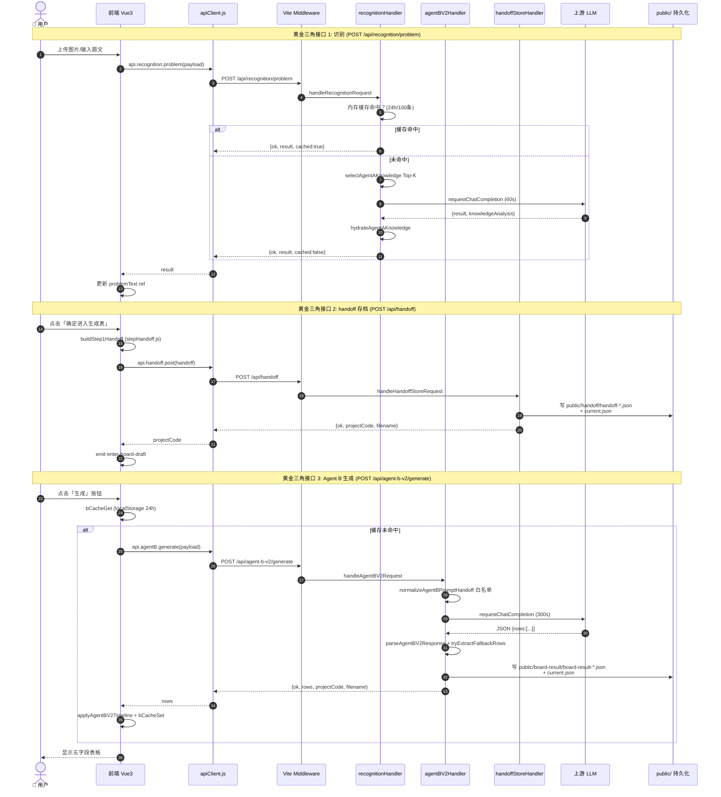

# 08 · 阶段二 · 接 API 总闸与数据通链

> 阶段四·管线铺设产出 ｜ 生成时间：2026-09-17
> 指派对象：开发 / 高级工程 / 全栈 subagent
> 阶段目标：打通核心 API 通道，确保数据流通畅
> 阶段产出：① 核心 API 接入清单 ② 统一交互配置文档 ③ 数据流 Mermaid 图

---

## 一、核心 API 接入清单（黄金三角优先）

### 1.1 黄金三角接口（最高优先级）

> 「黄金三角接口」= 认证 + 用户 + 首屏数据

| # | 端点 | 方法 | 用途 | 当前状态 | 接入优先级 |
|---|---|---|---|:---:|:---:|
| 1 | `/api/recognition/problem` | POST | Agent A 识别（贴题后第一步） | ✅ 已接入 | P0 |
| 2 | `/api/agent-b-v2/generate` | POST | Agent B 生成五字段 | ✅ 已接入 | P0 |
| 3 | `/api/handoff` | GET/POST | handoff 实体文件读写 | ✅ 已接入 | P0 |

### 1.2 核心 API 全清单（22 个端点）

#### 1.2.1 Agent A 识别组

| 端点 | 方法 | 前端调用方 | 后端 handler | 上游依赖 | 持久化 | 状态 |
|---|---|---|---|---|---|:---:|
| `/api/recognition/problem` | POST | `recognitionClient.js:36` | `recognitionHandler.js:63` | OpenAI 兼容 | 内存缓存 24h/100 | ✅ |
| `/api/mock/problem` | GET | （未接入，dev 调试用） | 内联 `vite.config.js:34` | 无 | 无 | ⚠️ prod 不应保留 |

#### 1.2.2 Agent B 生成组

| 端点 | 方法 | 前端调用方 | 后端 handler | 上游依赖 | 持久化 | 状态 |
|---|---|---|---|---|---|:---:|
| `/api/agent-b-v2/generate` | POST | `service.js:28` | `agentBV2Handler.js:132` | OpenAI / Anthropic | `public/board-result/` | ✅ |

#### 1.2.3 Check Agent C 组

| 端点 | 方法 | 前端调用方 | 后端 handler | 上游依赖 | 持久化 | 状态 |
|---|---|---|---|---|---|:---:|
| `/api/check-agent/check` | POST | `check-agent/service.js:47` | `checkAgentHandler.js:164` | OpenAI（25s）+ ASR 兜底 | 读 `public/board-result/` | ✅ |
| `/api/check-agent/apply` | POST | `check-agent/service.js:96` | `checkAgentHandler.js:408` | 无 | 写 `public/board-result/` + `.original.json` | ✅ |
| `/api/check-agent/revert` | POST | `check-agent/service.js:108` | `checkAgentHandler.js:376` | 无 | 读 `.original.json` + 覆写 | ✅ 已接入 |

#### 1.2.4 Handoff 实体存档组

| 端点 | 方法 | 前端调用方 | 后端 handler | 上游依赖 | 持久化 | 状态 |
|---|---|---|---|---|---|:---:|
| `/api/handoff` | GET | `DirectFlow.vue:18` + `AgentBDirect.vue:109,1498` | `handoffStoreHandler.js:142` | 无 | 读 `public/handoff/current.json` | ✅ |
| `/api/handoff` | POST | `Step1Entry.vue:700` | `handoffStoreHandler.js:142` | 无 | 写 `public/handoff/handoff-*.json` + `current.json` | ✅ |
| `/api/handoff/list` | GET | （未接入，可加历史列表 UI） | `handoffStoreHandler.js:175` | 无 | 读目录 | ✅ 后端就绪，前端可选 |
| `/handoff/<filename>` | GET（静态） | `DirectFlow.vue` window.open | `handoffStoreHandler.js:190-210` | 无 | 读 `public/handoff/<filename>` | ✅ |

#### 1.2.5 Screenshot 截图组

| 端点 | 方法 | 前端调用方 | 后端 handler | 上游依赖 | 持久化 | 状态 |
|---|---|---|---|---|---|:---:|
| `/api/screenshot` | POST | `Step1Entry.vue:630` | `screenshotStoreHandler.js:33` | 无 | 写 `public/pic/shot-*.jpg` | ✅ |
| `/pic/<filename>` | GET（静态） | `RealBoardPreview.vue:13` 默认值 | `screenshotStoreHandler.js:69-81` | 无 | 读 `public/pic/<filename>` | ✅ |

#### 1.2.6 Deliverable 交付物组

| 端点 | 方法 | 前端调用方 | 后端 handler | 上游依赖 | 持久化 | 状态 |
|---|---|---|---|---|---|:---:|
| `/api/deliverable` | GET | `BoardPreviewApp.vue:189` | `deliverableStoreHandler.js:291` | 无 | 读 `public/deliverable/current.json` | ✅ |
| `/api/deliverable?id=<code>` | GET | `BoardPreviewApp.vue` | `deliverableStoreHandler.js:291` | 无 | 读 `public/deliverable/deliverable-<code>.json` | ✅ |
| `/api/deliverable/list` | GET | （未接入，可加历史列表 UI） | `deliverableStoreHandler.js:344` | 无 | 读目录 | ✅ 后端就绪 |
| `/api/deliverable/api-spec` | GET | `AgentBDirect.vue:1345` | `deliverableStoreHandler.js:325` | 无 | 读 `doc/DELIVERABLE_API_SPEC.md` | ✅ |
| `/api/deliverable` | POST | `AgentBDirect.vue:1389` | `deliverableStoreHandler.js:291` | 无 | 写 `public/deliverable/deliverable-*.{json,html}` + `current.*` | ✅ |
| `/api/deliverable/update-sync` | POST | （未接入，可加同步按钮） | `deliverableStoreHandler.js:353` | 无 | 读+覆写 deliverable | ✅ 后端就绪 |
| `/api/deliverable/update-layout` | POST | （未接入，可加布局调整 UI） | `deliverableStoreHandler.js:391` | 无 | 读+覆写 deliverable | ✅ 后端就绪 |
| `/deliverable/<filename>` | GET（静态） | `AgentBDirect.vue:1433` window.open | `deliverableStoreHandler.js:483-547` | 无 | 读 `public/deliverable/<filename>` | ⚠️ handdraw-player.html 404 |

#### 1.2.7 Knowledge 知识点修缮组

| 端点 | 方法 | 前端调用方 | 后端 handler | 上游依赖 | 持久化 | 状态 |
|---|---|---|---|---|---|:---:|
| `/api/knowledge/refine` | POST | `AgentBDirect.vue:1466` | `knowledgeRefineHandler.js:79` | OpenAI 兼容（60s） | 写 `.original.json` + 覆写 handoff | ✅ |
| `/api/knowledge/revert` | POST | `AgentBDirect.vue` 还原按钮 | `knowledgeRefineHandler.js:88`（分支不可达） | 无 | 读 `.original.json` + 覆写 | ❌ **L3-B01 BUG** |

#### 1.2.8 TTS 合成组

| 端点 | 方法 | 前端调用方 | 后端 handler | 上游依赖 | 持久化 | 状态 |
|---|---|---|---|---|---|:---:|
| `/api/tts/info` | GET | `AgentBDirect.vue` 配置抽屉 | `fishAudioHandler.js:285` | 无 | 无 | ✅ |
| `/api/tts/synthesize` | POST | `AgentBDirect.vue:678,716` | `fishAudioHandler.js:285` | fish.audio | 写 `public/audio-cache/<md5>.mp3` | ✅ |
| `/api/tts/save-local` | POST | `AgentBDirect.vue:754` | `fishAudioHandler.js:285` | fish.audio | 写 `public/audio/audio-*-stepN.mp3` + ⚠️ `public/pic/audio-*-stepN.mp3` 副本 | ✅ |
| `/api/tts/batch` | POST | （未接入，可加批量 TTS 按钮） | `fishAudioHandler.js:285` | fish.audio | 写 audio-cache | ✅ 后端就绪 |

#### 1.2.9 Cleanup 清理组

| 端点 | 方法 | 前端调用方 | 后端 handler | 上游依赖 | 持久化 | 状态 |
|---|---|---|---|---|---|:---:|
| `/api/cleanup` | POST | `AgentBDirect.vue:152` | `cleanupHandler.js:65` | 无 | 删 5 目录非保留集 | ⚠️ 误删 `.original.json` |

#### 1.2.10 Health 健康检查组

| 端点 | 方法 | 前端调用方 | 后端 handler | 上游依赖 | 持久化 | 状态 |
|---|---|---|---|---|---|:---:|
| `/api/health` | GET | （未接入，可加状态指示器） | 内联 `vite.config.js:24` + `productionServer.js:37` | 无 | 无 | ✅ |

### 1.3 API 接入缺口清单

| 缺口 | 影响 | 治理优先级 |
|---|---|:---:|
| `/api/knowledge/revert` 不可达 | 还原功能完全失效 | 🔴 P0 |
| `/api/handoff/list` 前端未接入 | 无历史列表 UI | 🟡 P2 |
| `/api/deliverable/list` 前端未接入 | 无交付物历史 UI | 🟡 P2 |
| `/api/deliverable/update-sync` 前端未接入 | 无同步按钮 | 🟡 P3 |
| `/api/deliverable/update-layout` 前端未接入 | 无布局调整 UI | 🟡 P3 |
| `/api/tts/batch` 前端未接入 | 无批量 TTS | 🟡 P3 |
| `/api/health` 前端未接入 | 无状态指示器 | 🟢 P3 |
| `/api/mock/problem` prod 应禁用 | 数据污染 | 🟡 P1 |
| `/deliverable/handdraw-player.html` 404 | 打开产物失败 | 🔴 P0 |
| `/pic/audio-*.mp3` content-type 错配 | 音频副本无法播放 | 🟡 P1 |
| 16 个端点缺 Vercel Function | 部署后 404 | 🔴 P0 |

### 1.4 字段不符规范记录

| # | 端点 | 字段 | 问题 | 治理动作 |
|---|---|---|---|---|
| 1 | `/api/check-agent/check` | board | `check-agent/contract.js:39-41` 只接受 string，但 Agent B 输出 `{content, startDelay}` 对象 | 改为支持对象 |
| 2 | `/api/check-agent/check` | changes | prompt 声明可输出 `board_timing`，但 ALLOWED_FIELDS 不含 | 加入白名单 |
| 3 | `/api/agent-b-v2/generate` | degraded | 代码新增字段未文档化 | 补 DELIVERABLE_API_SPEC.md |
| 4 | `/api/check-agent/check` | checkStatus | 5 处降级响应字段未文档化 | 补 DELIVERABLE_API_SPEC.md |
| 5 | `/api/deliverable` | plan | 代码新增字段未文档化 | 补 DELIVERABLE_API_SPEC.md |
| 6 | `/api/deliverable` | totalDurationMs | 代码新增字段未文档化 | 补 DELIVERABLE_API_SPEC.md |
| 7 | `/api/deliverable` | timingPolicy | 代码新增字段未文档化 | 补 DELIVERABLE_API_SPEC.md |

---

## 二、统一交互配置文档

### 2.1 全局请求拦截器配置

> 当前前端无全局拦截器，所有 fetch 调用分散在各文件。
> 建议抽 `src/services/apiClient.js` 统一封装。

#### 2.1.1 统一请求封装（建议新增）

```javascript
// src/services/apiClient.js （新增）
const DEFAULT_TIMEOUT_MS = 30000  // 默认 30s
const LONG_TIMEOUT_MS = 300000   // 长生成 5min（B 生成用）

export async function apiFetch(path, options = {}) {
  const {
    method = 'GET',
    body,
    timeoutMs = DEFAULT_TIMEOUT_MS,
    signal,  // 支持外部 AbortController
  } = options
  
  const controller = new AbortController()
  const timeoutId = setTimeout(() => controller.abort(), timeoutMs)
  
  // 合并外部 signal
  if (signal) {
    signal.addEventListener('abort', () => controller.abort())
  }
  
  try {
    const fetchOptions = {
      method,
      headers: { 'Content-Type': 'application/json' },
      signal: controller.signal,
    }
    if (body !== undefined) fetchOptions.body = JSON.stringify(body)
    
    const response = await fetch(path, fetchOptions)
    const data = await response.json().catch(() => ({}))
    
    if (!response.ok) {
      const err = new Error(data.error || `HTTP ${response.status}`)
      err.code = data.code
      err.statusCode = response.status
      err.payload = data
      throw err
    }
    
    return data
  } finally {
    clearTimeout(timeoutId)
  }
}

// 各 handler 用法
export const api = {
  recognition: {
    problem: (payload) => apiFetch('/api/recognition/problem', { method: 'POST', body: payload, timeoutMs: 60000 }),
  },
  agentB: {
    generate: (payload) => apiFetch('/api/agent-b-v2/generate', { method: 'POST', body: payload, timeoutMs: LONG_TIMEOUT_MS }),
  },
  checkAgent: {
    check: (payload) => apiFetch('/api/check-agent/check', { method: 'POST', body: payload, timeoutMs: 30000 }),
    apply: (payload) => apiFetch('/api/check-agent/apply', { method: 'POST', body: payload }),
    revert: () => apiFetch('/api/check-agent/revert', { method: 'POST' }),
  },
  handoff: {
    get: () => apiFetch('/api/handoff'),
    post: (handoff) => apiFetch('/api/handoff', { method: 'POST', body: { handoff } }),
    list: () => apiFetch('/api/handoff/list'),
  },
  screenshot: {
    save: (imageBase64) => apiFetch('/api/screenshot', { method: 'POST', body: { imageBase64 } }),
  },
  deliverable: {
    get: (id) => apiFetch(`/api/deliverable${id ? `?id=${id}` : ''}`),
    list: () => apiFetch('/api/deliverable/list'),
    post: (deliverable) => apiFetch('/api/deliverable', { method: 'POST', body: { deliverable } }),
    apiSpec: () => apiFetch('/api/deliverable/api-spec'),
    updateSync: (payload) => apiFetch('/api/deliverable/update-sync', { method: 'POST', body: payload }),
    updateLayout: (payload) => apiFetch('/api/deliverable/update-layout', { method: 'POST', body: payload }),
  },
  knowledge: {
    refine: (payload) => apiFetch('/api/knowledge/refine', { method: 'POST', body: payload, timeoutMs: 60000 }),
    revert: () => apiFetch('/api/knowledge/revert', { method: 'POST' }),
  },
  tts: {
    info: () => apiFetch('/api/tts/info'),
    synthesize: (payload) => apiFetch('/api/tts/synthesize', { method: 'POST', body: payload }),
    saveLocal: (payload) => apiFetch('/api/tts/save-local', { method: 'POST', body: payload }),
    batch: (payload) => apiFetch('/api/tts/batch', { method: 'POST', body: payload }),
  },
  cleanup: {
    post: () => apiFetch('/api/cleanup', { method: 'POST' }),
  },
  health: {
    get: () => apiFetch('/api/health'),
  },
}
```

#### 2.1.2 后端统一响应体格式（已基本一致，需补充）

**当前格式**（已统一）：
```json
// 成功
{ "ok": true, "data": {...} } 或 { "ok": true, ...其他字段 }

// 失败
{ "ok": false, "code": "ERROR_CODE", "error": "错误描述", "diagnostic": {...} }
```

**建议补充**：
- 所有成功响应统一加 `timestamp` 字段
- 所有失败响应加 `requestId` 字段（用于追踪）
- 错误码标准化（如 `INVALID_INPUT` / `UPSTREAM_TIMEOUT` / `PARSE_FAILED` / `INTERNAL_ERROR`）

### 2.2 后端中间件统一规则

> 当前后端无统一中间件层，各 handler 各自处理 CORS / sendJson / readJsonBody。
> 建议抽 `server/middleware.js` 统一封装。

#### 2.2.1 统一中间件链（建议新增）

```javascript
// server/middleware.js （新增）
import { applyCors, sendJson, readJsonBody } from './http.js'
import { safeFilePath } from './safeFile.js'

// 通用中间件：CORS + JSON 解析 + 错误捕获
export function withMiddleware(handler, options = {}) {
  const { requireBody = false, allowMethods = ['POST', 'OPTIONS'] } = options
  
  return async (req, res, next) => {
    // OPTIONS 预检
    if (req.method === 'OPTIONS') {
      applyCors(req, res)
      res.statusCode = 204
      res.end()
      return true
    }
    
    // 方法校验
    if (!allowMethods.includes(req.method)) {
      sendJson(req, res, 405, { ok: false, code: 'METHOD_NOT_ALLOWED', error: `仅支持 ${allowMethods.join(', ')}` })
      return true
    }
    
    try {
      // JSON body 解析
      if (requireBody && req.method === 'POST') {
        req.body = await readJsonBody(req)
      }
      
      // 执行 handler
      const handled = await handler(req, res, next)
      return handled
    } catch (err) {
      console.error('[middleware]', err)
      sendJson(req, res, 500, { ok: false, code: 'INTERNAL_ERROR', error: err.message })
      return true
    }
  }
}

// 静态文件服务（带路径穿越校验）
export function withSafeStatic(rootDir, options = {}) {
  const { contentType } = options
  return (req, res, next) => {
    const filename = decodeURIComponent(req.url.replace(/^\/[^/]+\//, ''))
    const fullPath = safeFilePath(rootDir, filename)
    if (!fullPath) {
      return next()  // 路径穿越，跳过
    }
    // ...读文件 + 设置 content-type + 返回
  }
}
```

### 2.3 数据传递解耦校验

> 「清理跨模块的非规调用，确保通过 Store、Service 或 Event Bus 传递数据」

#### 2.3.1 当前跨模块调用清单

| 来源 | 目标 | 方式 | 评估 |
|---|---|---|---|
| `AgentBDirect.vue` | 14 个 API endpoint | 直接 fetch | 🔴 应通过 `apiClient.js` |
| `AgentBDirect.vue` | localStorage | 直接 setItem | 🟡 应通过 `storeClient.js` |
| `BoardContentLayer.vue` | localStorage | 直接 setItem | 🔴 与 Step1Entry 双写竞争 |
| `checkAgentHandler.js` | `boardResultStore.readCurrentResult` | 直接 import | 🔴 应通过参数传入 |
| `deliverableStoreHandler.js` | `src/utils/boardLayout.js` + `src/agent-b-v2/timing.js` | 直接 import | 🟡 跨层但合理（运行时同进程） |
| `check-agent/contract.js` | `agent-b-v2/contract.js normalizeAgentBV2ActionSpec` | 直接 import | 🟡 跨模块但合理 |

#### 2.3.2 解耦建议

| 解耦点 | 当前 | 建议 |
|---|---|---|
| 前端 API 调用 | 14 处直接 fetch | 统一走 `src/services/apiClient.js` |
| 前端 localStorage | 8+ 处直接 setItem | 统一走 `src/services/storeClient.js` |
| 后端跨 handler 读 | `checkAgentHandler` 读 `boardResultStore` | 通过 `req.body.currentRows` 优先（已实现） |
| 后端跨层 import | `deliverableStoreHandler` import 前端 `timing.js` | 合理保留（运行时同进程） |
| 前端跨模块 import | `check-agent/contract.js` import `agent-b-v2/contract.js` | 抽 `src/contracts/shared.js` |

---

## 三、数据流 Mermaid 图

### 3.1 治理后数据流图

```mermaid
flowchart TB
    subgraph Browser["浏览器"]
        UI["Vue 组件<br/>(拆分后)"]
        ApiClient["apiClient.js<br/>统一 fetch 封装"]
        StoreClient["storeClient.js<br/>统一 localStorage"]
        Composables["Composables<br/>useBGeneration/useTTSPlayer/..."]
        
        UI --> Composables
        Composables --> ApiClient
        Composables --> StoreClient
    end
    
    subgraph ViteDev["Vite Dev Middleware"]
        Middleware["middleware.js<br/>withMiddleware + withSafeStatic"]
        
        subgraph Handlers["server/ handlers"]
            RH["recognitionHandler"]
            ABH["agentBV2Handler"]
            CAH["checkAgentHandler"]
            HSH["handoffStoreHandler"]
            DSH["deliverableStoreHandler"]
            SSH["screenshotStoreHandler"]
            KRH["knowledgeRefineHandler<br/>✅ /revert 修复"]
            FAH["fishAudioHandler<br/>✅ Key 移 .env"]
            CLH["cleanupHandler<br/>✅ 保留 .original.json"]
        end
        
        Middleware --> RH
        Middleware --> ABH
        Middleware --> CAH
        Middleware --> HSH
        Middleware --> DSH
        Middleware --> SSH
        Middleware --> KRH
        Middleware --> FAH
        Middleware --> CLH
    end
    
    subgraph SharedServer["server/ 公共模块"]
        ProjectCode["projectCode.js<br/>✅ 公共"]
        Backup["backup.js<br/>✅ 公共"]
        Constants["constants.js<br/>✅ 公共"]
        SafeFile["safeFile.js<br/>✅ 路径校验"]
        HttpUtils["http.js<br/>CORS/sendJson/readJsonBody"]
    end
    
    subgraph SharedFront["src/contracts/"]
        SharedContract["shared.js<br/>✅ 共享 normalizeActionSpec"]
    end
    
    subgraph Persist["public/ 持久化"]
        HDir["handoff/<br/>+ .original.json"]
        BRDir["board-result/<br/>+ .original.json ✅ 保留"]
        DDir["deliverable/<br/>✅ 内联模板"]
        PicDir["pic/<br/>✅ 仅 JPG"]
        AudDir["audio/"]
        AudCDir["audio-cache/"]
    end
    
    subgraph EnvLayer[".env"]
        Env["FISH_AUDIO_API_KEYS=<br/>CORS_ORIGINS=<br/>UPSTREAM_HOSTS=api.openai.com,<br/>api.anthropic.com,api.fish.audio"]
    end
    
    subgraph Upstreams["上游"]
        OpenAI["OpenAI 兼容"]
        Anthropic["Anthropic"]
        FishAudio["Fish Audio"]
        Knowledge["knowledge-a.compact.json"]
    end
    
    ApiClient -->|fetch /api/*| Middleware
    StoreClient -->|localStorage| Browser
    
    RH --> ProjectCode
    ABH --> ProjectCode
    CAH --> ProjectCode
    HSH --> ProjectCode
    DSH --> ProjectCode
    
    HSH --> Backup
    DSH --> Backup
    KRH --> Backup
    BRStore["boardResultStore.js"] --> Backup
    
    HSH --> SafeFile
    SSH --> SafeFile
    DSH --> SafeFile
    
    RH --> OpenAI
    RH --> Knowledge
    ABH --> OpenAI
    ABH --> Anthropic
    CAH --> OpenAI
    KRH --> OpenAI
    FAH --> FishAudio
    FAH --> Env
    
    HSH --> HDir
    DSH --> DDir
    SSH --> PicDir
    FAH --> AudCDir
    FAH --> AudDir
    KRH --> HDir
    BRStore --> BRDir
    
    style ApiClient fill:#ccccff,stroke:#6666cc
    style StoreClient fill:#ccccff,stroke:#6666cc
    style Middleware fill:#ccccff,stroke:#6666cc
    style ProjectCode fill:#ccccff,stroke:#6666cc
    style Backup fill:#ccccff,stroke:#6666cc
    style Constants fill:#ccccff,stroke:#6666cc
    style SafeFile fill:#ccccff,stroke:#6666cc
    style SharedContract fill:#ccccff,stroke:#6666cc
    style KRH fill:#ccffcc,stroke:#009900
    style FAH fill:#ccffcc,stroke:#009900
    style CLH fill:#ccffcc,stroke:#009900
    style Env fill:#fff4cc,stroke:#ccaa00
```



### 3.2 黄金三角接口数据流详图



### 3.3 非核心 API 分批接入计划

| 批次 | 接口 | 接入时机 | 优先级 |
|---|---|---|:---:|
| 1 | `/api/knowledge/revert` 修复 + `/api/tts/batch` 接入 | 与黄金三角同步 | P0 |
| 2 | `/api/handoff/list` + `/api/deliverable/list` 历史列表 UI | 阶段四完成后 | P2 |
| 3 | `/api/deliverable/update-sync` + `/api/deliverable/update-layout` | 阶段五 | P3 |
| 4 | `/api/health` 状态指示器 | 阶段六 | P3 |
| 5 | 16 个 Vercel Function 补全 | 阶段六 | P0 |

---

## 四、subagent 任务交接

### 4.1 指派任务

> **指派任务给：全栈 subagent**
> **Task ID：5**

**任务目标**：接 API 总闸与数据通链，包括黄金三角接口加固 + 16 个端点字段规范修复 + 统一拦截器与中间件 + 跨模块解耦

**约束**：
1. **不动 A/B 主链路业务逻辑**：contract / prompt / stepHandoff / service / timing 不动
2. **不删预设账号**：userApiConfig.js / agentBApiConfig.js / checkAgentApiConfig.js 默认值保留
3. **不补 handdraw-player.html / lite-player.html**：用户明示不补回
4. **不引入新依赖**：仅用现有 Vue3 + Node API
5. **改一测一**：每改一个接口，立即跑 `npm run check:proxy` + 浏览器手测

**预期产出**：
- 新增 `src/services/apiClient.js` 统一 fetch 封装（14 处调用替换）
- 新增 `src/services/storeClient.js` 统一 localStorage 封装（8+ 处替换）
- 新增 `server/middleware.js` 统一中间件链
- 新增 `server/safeFile.js` 路径穿越校验（修复 5 处漏洞）
- 新增 `server/projectCode.js` 公共函数（3 处复制消除）
- 新增 `server/backup.js` 公共函数（2 处复制消除）
- 新增 `server/constants.js` 公共常量
- 新增 `src/contracts/shared.js` 共享 normalizeActionSpec
- 修复 `knowledgeRefineHandler.js:88` `/revert` 分支
- 修复 `cleanupHandler.js` 保留 `.original.json`
- 修复 `fishAudioHandler.js` Key 移到 .env
- 修复 5 处目录穿越漏洞
- 修复 `check-agent/contract.js` board 支持对象
- 修复 `check-agent/contract.js` ALLOWED_FIELDS 加 `board_timing`
- 修复 `AgentBDirect.vue bCacheKey` 加 canvasParams
- 修复 `productionServer.js` mock/problem 加 NODE_ENV 守卫
- 修复 `vite.config.js` port 3000 → 3001
- 修复 `agentBV2Handler.js` OpenAI 超时 300s → 170s（适配 Vercel 180s）
- 字面值 1726/980/30 改 import stepHandoff.js（多处）
- 补 16 个 Vercel Function

**验证方式**：
- `npm run lint` 0 错
- `npm run check:proxy` 通过
- `npm run check:knowledge` 通过
- `npm run dev` 启动成功（端口 3001）
- 浏览器手测全链路（贴题 → 识别 → handoff → B → Check → revert → TTS → 导出 → deliverable）
- 手测 `/api/knowledge/revert` 返回 `{ok:true, reverted:true}`
- 手测 `GET /handoff/../../etc/passwd` 应 404
- 手测 `GET /pic/audio-xxx.mp3` 应正确 content-type（如果保留 pic 副本）或不再生成副本

**必读**：
- `/home/z/my-project/worklog.md`（若存在）
- `/home/z/my-project/download/01-深度扫描/02_业务逻辑流映射图.md`
- `/home/z/my-project/download/01-深度扫描/04_需求校准表.md`
- `/home/z/my-project/download/02-遗留治理/05_遗留问题分级清单.md`
- `/home/z/my-project/download/02-遗留治理/06_治理记录与解耦边界图.md`

**完成后**：
- 追加 `/home/z/my-project/worklog.md`，段落以 `---` 分隔
- 更新 `PROJECT_STATE.md` API 唯一真相段落
- 更新 `doc/DELIVERABLE_API_SPEC.md` 补全新增字段（plan/totalDurationMs/timingPolicy/degraded/checkStatus）
- 更新 `doc/minimal-runtime-loop.md` 主链索引

---

> 阶段四 API 通链交接完毕。下一阶段（阶段五·UI 优化）将交接给 全栈 subagent。
