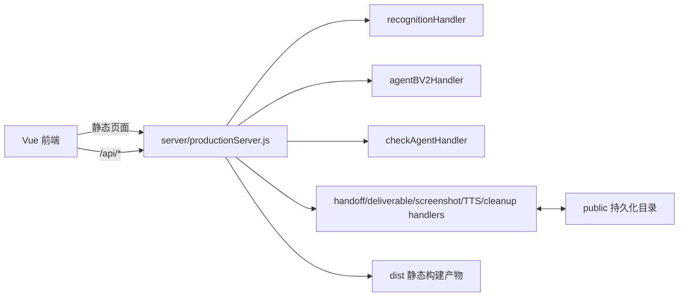

# 项目实时架构模块图

## 当前施工状态

- 已完成：`bun run start` 单进程生产入口；复用既有 handlers；`dist/` 静态页面与 `public/` 档案读取；清理接口方法边界。
- 已验证：首页、handoff、deliverable、受控清理的 GET/OPTIONS 边界和保护对象。
- 待执行：取得甲方服务器目标后进行只读预检，按环境选择 systemd + Nginx 或 Docker Compose，并将 `public/` 置于持久化目录/卷。
