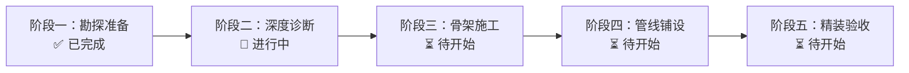

# 项目实时架构模块图与施工进展

## 1. 系统全景设计规划图
```mermaid
flowchart TD
  subgraph Presentation [表现层 (UI/Pages/Components)]
    A1[App.vue / index.html] --> S1[Step1Entry.vue (题目输入与配置)]
    S1 --> DF[DirectFlow.vue (工作流编排)]
    DF --> AB[AgentBDirect.vue (Agent B 教学工作台)]
    AB --> VT[VisualTimeline.vue (时间轴组件)]
    AB --> BC[BoardContentLayer.vue (真实板书渲染)]
    AB --> RP[RealBoardPreview.vue (板书预览)]
    AB --> ML[ProcessLoadingModal.vue (加载弹窗)]
    BP[board-preview.html / BoardPreviewApp.vue] --> BC
    PL[row-player.html / lite-player.html (独立播放器)] --> Assets[public/ 静态资源与音频]
  end

  subgraph BusinessLogic [业务逻辑层 (Services/Skills/Rules)]
    S1 --> RC[services/recognitionClient.js (识别客户端)]
    S1 --> SH[services/stepHandoff.js (A->B交接数据流)]
    AB --> BS[agent-b-v2/service.js (Agent B 服务)]
    AB --> CS[check-agent/service.js (Check Agent 服务)]
    BS --> BSkills[agent-b-v2/skills/* (动态教学技能)]
    CS --> ASRLocal[check-agent/asrPolish.js (本地 ASR 规范引擎)]
  end

  subgraph BoardToolsEngine [视觉手绘与排版引擎 (board-tools/utils)]
    BC --> RD[board-tools/roughDrawingTool.js (Rough.js手绘)]
    BC --> RN[board-tools/roughNotationTool.js (文本标注)]
    BC --> HA[board-tools/handActionScheduler.js (动作调度器)]
    BC --> BL[utils/boardLayout.js (四区排版算法)]
    BC --> CC[utils/canvasCoords.js (坐标映射)]
  end

  subgraph Infrastructure [基础设施与数据层 (Lib/Server/Storage)]
    UAC[lib/userApiConfig.js] & BAC[lib/agentBApiConfig.js] & CAC[lib/checkAgentApiConfig.js] --> Upstream[外部大模型 API]
    ProdServer[server/productionServer.js] & Vite[vite.config.js] --> Handlers[server/*Handler.js]
    Handlers --> KB[(doc/knowledge-a.compact.json 247条知识库)]
    Handlers --> PublicStore[(public/ 物理持久化目录)]
  end
```

---

## 2. 施工进展图 (Progress Roadmap)


---

## 3. 重构施工 TODO 清单
- [x] **阶段一：勘探准备**
  - [x] 完成 4 层 X-RAY 深度扫描
  - [x] 绘制系统全景依赖图
  - [x] 产出 `resource_list.md`（可复用资源清单）
  - [x] 产出 `risk_matrix.md`（止血三板斧与风险矩阵）
  - [x] 产出 `project_initial_state.md`（初始状态快照）
- [ ] **阶段二：深度诊断**
  - [ ] 目录职责标注（UI / 业务逻辑 / 数据层 / 工具）
  - [ ] 三层业务扫描（表现层 -> 业务逻辑层 -> 数据层）
  - [ ] 六维度 1-5 分评估（可读性/可维护性/性能/安全性/可测试性/可扩展性）
  - [ ] 产出 `diagnostic_report.md` 与校准后的需求优先级
- [ ] **阶段三：骨架施工**
  - [ ] 页面四分类与依赖方向确立
  - [ ] 耦合点标记与解耦方案设计
  - [ ] `AgentBDirect.vue` 核心组件解耦拆分
  - [ ] 公共 API 配置中心模块化收口
- [ ] **阶段四：管线铺设**
  - [ ] 黄金三角 API 优先校验与数据流解耦
  - [ ] 统一 Service 层与 `{code, message, data}` 错误处理
  - [ ] 修复 `server/proxySelfCheck.js` 单测断言偏差
- [ ] **阶段五：精装验收**
  - [ ] 全链路数据驱动 UI 校验
  - [ ] 主链路冒烟测试（识别 -> 生成 -> 质检 -> 交付物打包）
  - [ ] P0-P4 评级与零报错启动验证
  - [ ] 固化 `code_standards.md` 并输出最终交付包